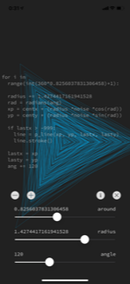
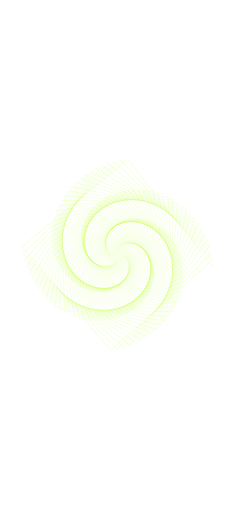
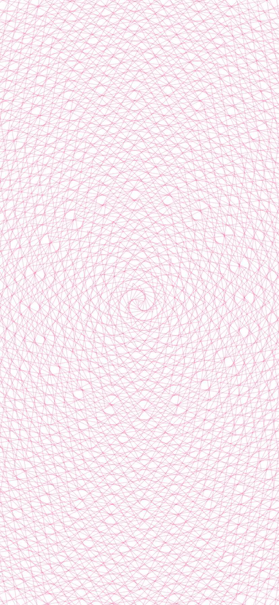
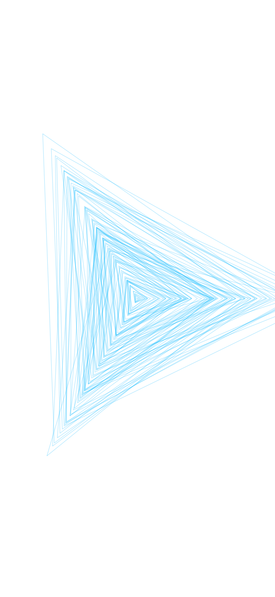
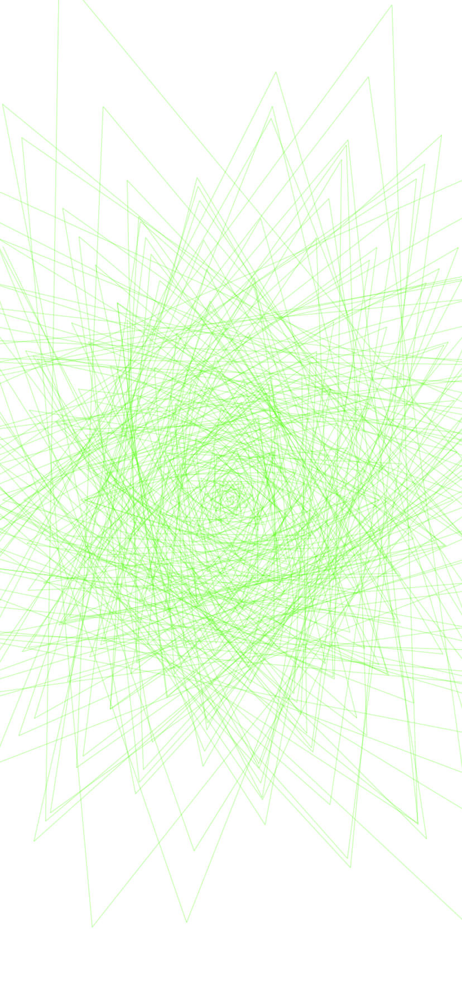

# pysta-repeat_line

Run with a [Pythonista 3](http://omz-software.com/pythonista/) App.

I was inspired by the coding of the [Processing](https://processing.org/).

  

## Description

### Sliders

- `around`
	- 0.0 ~ 2.0
- `radius`
	- 0.0 ~ 2.0
- `angle`
	- 0 ~ 360

### Buttons

- `-`
	- decrement to `angle`.
- `+`
	- increment to `angle`.
- `i`
	- to console.
- `×`
	- close.

## Perlin Noise

Reference : [Understanding Perlin Noise](http://flafla2.github.io/2014/08/09/perlinnoise.html)

> [Reference Japanese translation](https://postd.cc/understanding-perlin-noise/)

## screenshot

### [`straight.py`](./straight.py)

### [`perlin.py`](./perlin.py)

