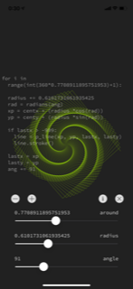
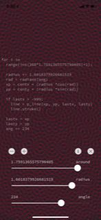

# pysta-repeat_line

Run with a [Pythonista 3](http://omz-software.com/pythonista/) App.

 

## Description

### Sliders

- `around`
	- 0.0 ~ 2.0
- `radius`
	- 0.0 ~ 2.0
- `angle`
	- 0 ~ 360

### Buttons

- `-`
	- decrement to `angle`.
- `+`
	- increment to `angle`.
- `i`
	- to console.
- `×`
	- close.

##screenshot

### `straight.py`
